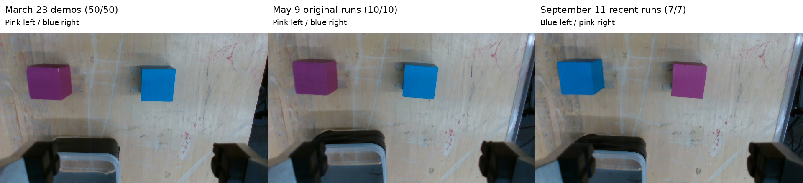
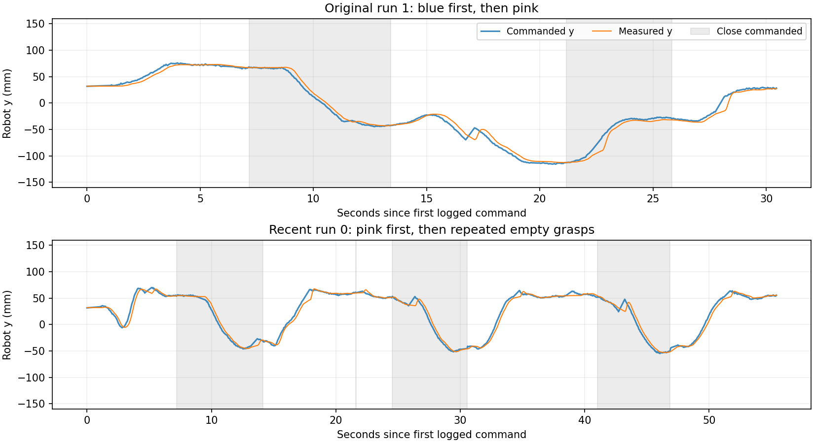

# Investigation of the both-in-bin policy regression

The strongest explanation in the supplied recordings is a **reversal of the blocks’ starting positions**, which was absent from the 50 supplied training demonstrations. There is also a real inference timing change since the original rollouts. The evidence does **not** point to a major arm-controller, normalization, checkpoint, or gripper-speed regression. Restoring the original block arrangement is the first experiment I would run; the recordings alone cannot establish causality.

Analysis performed September 12, 2026, using the local `openteach/main` and `lerobot/feat/pi05_kv_cache` histories, recorded camera frames, robot command/state logs, and saved recent inference inputs and provenance. Robot operation and deployment were not part of this investigation. Existing source edits were preserved.

**The reference dates are March 23, May 9, and September 11.**

| Dataset | Runs examined | Recorded date, America/New_York | Initial wrist-view layout |
|---|---:|---|---|
| `both_in_bin_interleaved` | 50 | March 23, 2026 | Pink left, blue right: 50/50 |
| `base_rollouts_original` | 10 | May 9, 2026 | Pink left, blue right: 10/10 |
| `demonstration_dracorex_base_*` | 7 | September 11, 2026 | Blue left, pink right: 7/7 |

Dates come from internal timestamps, not directory modification times. The September recordings are September 12 in UTC. The original-rollout directory is therefore a **May baseline**, despite the March training date. Original run 0 has a readable `deoxys_obs_cmd_history_...h5.884292.tmp` file; it is included in the aggregate dynamics analysis. The separate controller-formula comparison uses the other nine original logs plus all seven recent logs.

**The environment change is categorical, not merely small placement variation.**

The two spatial slots are almost unchanged in the reset wrist view: approximately x=110 and x=366 pixels in a 640×360 image. What changed is the color occupying each slot. Median initial centers:

| Group | Pink center, pixels | Blue center, pixels |
|---|---|---|
| March demonstrations | (111.8, 107.7) | (368.3, 114.3) |
| May original rollouts | (111.7, 105.5) | (364.7, 112.4) |
| September recent rollouts | (366.5, 112.0) | (109.2, 101.7) |

This was checked by color segmentation and visual inspection of **every initial wrist frame**. The `_blue` and `_pink` demonstration suffixes do not imply coverage of both block layouts: both subsets use pink-left/blue-right. See the [50-demo contact sheet](visuals/demo_initial_wrist.jpg), [10 original initial views](visuals/original_initial_wrist.jpg), [7 recent initial views](visuals/recent_initial_wrist.jpg), and [per-run centers](visuals/initial_scene_metrics.json). Physical identity beyond visible color and shape cannot be established from images alone.

Static table-texture registration, excluding the blocks and bin, finds small apparent view changes relative to original run 1: median displacement about 3.90 pixels in camera 0, 0.77 pixels in the wrist camera, and 1.81 pixels in camera 2. The March-to-May wrist difference was larger, about 4.76 pixels. Registered wrist table-depth patches are nearly unchanged in their native depth units. Other depth views contain invalid/extreme values, so these recordings do not support a precise metric estimate of table or camera relocation. Small lighting, mount or bin-placement changes remain possible, but the block-color reversal is much larger than the observed registration changes. See [registration results](visuals/static_camera_summary.json).

**The failure behavior fits a learned association between color and position.**

The recent policy can reach, grasp, carry, and release a block. Across all seven recent videos, it eventually transfers one block into the bin but leaves the other behind. Run 4 misses its first attempt, then succeeds at grasping the blue block. After the first successful placement, the recurring failure is a grasp toward an empty location; the remaining block sits well to one side in the wrist image.

The command logs distinguish this from the robot failing to follow a correct target:

- All 10 original runs change the sign of robot y between their first and second sustained close events, moving between the two pickup sides.
- All 7 recent runs keep the same y sign at subsequent sustained close events. In the five recent right-side/pink-first runs, subsequent grasp targets remain near y=+0.05 to +0.06 m, where the first block was. The remaining blue block is on the opposite side.
- The original right-side block was blue. After picking pink from that side in the swapped scene, returning there to look for blue is consistent with a learned color/location shortcut. This mechanism is an inference from the behavior, not an experimentally proven internal representation.

The gray intervals indicate close commands, including transport while the gripper remains closed. Robot y is a robot-frame coordinate; left/right elsewhere in this report refers explicitly to the initial wrist image. See [original run 1](visuals/demonstration_base_prompt_no_intervention_1.jpg), [recent run 0](visuals/demonstration_dracorex_base_0.jpg), and [all sustained grasp sites](dynamics/sustained_grasp_sites.csv).

The original set is not perfect either: runs 4, 7, and 9 visibly leave pink on the table. The other seven visibly transfer both blocks toward/into the bin, with some blocks protruding at the rim. These are visual descriptions, not an independently defined binary task-success annotation. The recent 0/7 complete two-block transfers and original 7/10 two-block transfers should not be treated as a large, randomized success-rate estimate.

**Code changes: there is a real timing difference, but several major-looking changes are inactive.**

| Change | Evidence and relevance |
|---|---|
| Candidate batch grows from 1 to 15, September 9, `d9384365` | Base runs now generate multiple trajectories even with interventions disabled. All 91 saved recent chunks enqueue the unperturbed original candidate, first 75 steps. This adds inference work; no candidate-selection substitution was found. |
| Executed horizon becomes 50, then 75; September 9–11, `d9384365`, `2109ff7d` | The original logs show 100 commands between inference boundaries; all seven recent runs use 75. The current uncommitted launch-script edit sets 100, but was not the value used for these recordings. Shorter execution changes observation/replanning phase and increases boundary frequency. |
| Policy server introduced September 10, `7ba3d5e2` | Runtime source snapshots, processor statistics, saved inputs and model replay were checked. No evidence of a wrong checkpoint, wrong normalization, frozen image input, or changed base-policy numerical computation was found in the checks described below. |
| OpenTeach joint-control gains/filter/IK refactor, April 13–15 | These affect joint-control or VR teleoperation paths. The recorded policy uses `absolute_eef_pose_to_delta` with OSC. The active Cartesian conversion is unchanged in the offline numerical comparison. |
| OpenTeach VR rotation/scale/reset changes, April–May | Bypassed by policy calls that directly supply an absolute EEF target and gripper command. |
| OpenTeach camera recording codec, April 16, `12c35fa` | Changes saved videos/depth compression, not live policy camera geometry. Camera order, resolution and publisher/network code have no post-March change that explains these runs. |
| Deoxys C++ gripper worker, May 18/22 | An adjacent imported dependency has a real post-baseline gripper-worker change. Actual robot-side compiled-binary provenance was not established. The data provides little support for it as the primary cause: closing time and successful object-width grasps remain similar. |

LeRobot inspected HEAD: `89dff82b` (September 11). OpenTeach inspected HEAD: `60a4701` (May 25), with existing local changes. The LeRobot pre-May-9 comparison uses `f6ee46ad` (May 7); the OpenTeach March baseline is `f1ec57c` (March 12). Historical repository state does not prove what was deployed on May 9, so direct recorded evidence receives greater weight.

**Saved-input replay rules out several observation/model bugs.**

- All seven recent recordings identify the same checkpoint, and its recorded SHA-256 matches the current `outputs/both_in_bin_interleaved/checkpoints/003000/pretrained_model/model.safetensors`. The saved task is `place both blocks in the bin`, matching the May launcher. Saved processor configurations and normalization tensors match the checkpoint. There is no historical May model-file hash in the supplied old raw logs, so byte identity of the May weights cannot be independently established.
- Replayed chunks 0, 1, 3, 6 and 10 from each recent run using saved inputs and saved noise: **35/35 reproduce the saved model outputs bit-for-bit**. This is offline model inference, without a robot connection.
- With those same inputs and noise, changing batch size from 15 to 1 changes executed XYZ positions by a mean 0.127 mm and a maximum 0.534 mm across 2,625 steps; maximum orientation difference is 0.123 degrees, with no gripper open/close sign changes. This excludes a large batch-dependent numerical corruption in the tested cases. Extra random draws still change the future RNG sequence, so matching a seed alone would not reproduce a full rollout across implementations.
- Each camera input and state changes between chunks. In recent run 0, chunks 0, 3, 6 and 10, recorded model images match raw camera pixels exactly: side→camera 0, wrist→camera 1, front→camera 2 with its existing center crop. Matched frames are approximately 50–115 ms older than chunk start, before inference. This checks sampled observation identity and freshness; it does not assert every frame in every run was verified.

The [LeRobot audit](code/lerobot_regression_findings.md) and [OpenTeach audit](code/openteach_regression_findings.md) preserve commit/file references and replay details. The core base-policy sampling, KV cache and state/image processing have no identified post-baseline behavioral change that explains the repeated wrong-site commands.

**The timing increase is measurable but smaller than “no pause then, half a second now.”**

| Measured quantity | Original rollouts | Recent rollouts |
|---|---:|---:|
| Commands executed per chunk | 100 | 75 |
| Median interval within a chunk | 49.84 ms | 50.22 ms |
| Median interval crossing a chunk boundary | 378.7 ms | 499.5 ms |
| Boundary interval, 95th percentile | 401.0 ms | 527.8 ms |

The recent boundary interval is approximately **121 ms longer**, with a boundary every 3.75 seconds of commanded motion rather than every 5 seconds. There was already a substantial inference pause in May. Recorded recent median base sampling is about 392 ms and complete candidate generation about 443 ms. This can affect control timing and the age of observations used for a trajectory, but it does not by itself explain why the policy repeatedly selects the wrong pickup side. Test timing separately from the layout.

The 121 ms historical increase cannot be assigned entirely to the candidate count. An offline paired run in the current environment measured a smaller, variable difference between batches of 1 and 15; RPC, synchronous recording and historical runtime differences also remain relevant.

These intervals use command timestamps, exclude the initial deliberate startup gap, and identify boundaries from the command count. AVI headers report 30 FPS, but actual saved-frame cadence is lower; all timing comparisons use saved acquisition timestamps. Original videos start approximately 12.8 seconds before command logging, while recent videos start about 1.2 seconds before it. Some original videos continue long after command logging ends—original run 4 has about 41 seconds of camera-only tail—so equal frame number or equal fraction through two videos is not a valid control-time alignment. Contact sheets label elapsed camera time and are for visual review; quantitative comparisons use logs and absolute timestamps.

**Robot and gripper dynamics show no gross deterioration.**

| Descriptive measurement | Demos | Original | Recent |
|---|---:|---:|---:|
| Logged command/state samples | 27,481 | 6,727 | 6,825 |
| Median simultaneous target–EEF position difference | 11.44 mm | 10.86 mm | 10.20 mm |
| 95th percentile target–EEF position difference | 21.05 mm | 22.01 mm | 22.51 mm |
| Median measured EEF speed at ordinary sample intervals | 45.68 mm/s | 40.86 mm/s | 39.44 mm/s |
| Median close-command to width below 60 mm | 0.701 s | 0.698 s | 0.679 s |
| Sustained close events with object-width plateau | 100/100 | 17/25 | 7/21 |

Object-width plateaus are approximately 49 mm. Empty grasps instead close nearly fully. Width classifications are grasp proxies, not task-success labels. Events shorter than two seconds are excluded from these event counts because incomplete closure can look like a held object. The recent successes and failures differ mainly in whether a block is actually between the fingers.

Recorded controller metadata agrees where present: OSC_POSE, control 20 Hz, state 60 Hz, translation/rotation Kp 250, clipping limits 0.1/0.2, interpolation fraction 0.3, and matching residual mass settings. Initial joint/EEF pose and recorded tool transforms agree closely between May and September. The policy’s direct Cartesian conversion produces exactly identical old/current actions over **12,752 state/target pairs**; typical differences from recorded actions are also zero.

The target–EEF difference is measured at command issue time, before the command has finished executing. It is not final positioning accuracy or a controlled estimate of plant dynamics. Different targets, contacts, friction, payload, firmware and camera calibration prevent a conclusive physical-system equivalence claim. The evidence nevertheless argues against a large general loss of tracking or gripping ability as the leading explanation.

**Controlled follow-up, in order.**

1. **Restore the training layout first:** pink left, blue right in the reset wrist view, matching the figure above. Keep checkpoint, prompt, current software and timing fixed. Alternate original and reversed layouts across several runs, recording which block was grasped first and whether the second grasp switched sides. This isolates the strongest observed change.
2. **Then test inference cadence:** with the original layout fixed, compare the recorded 75-step/15-candidate configuration with a base-only 100-step/single-candidate configuration. Keep the same prompt, checkpoint, reset and camera setup. The current script’s uncommitted 100-step edit alone does not restore the old single-candidate behavior. A factorial 75/100 × 1/15 test can separate horizon from candidate-generation cost if needed.
3. **If restored layout still fails,** compare complete saved inputs and outputs at the second pickup, then perform a supervised fixed-trajectory comparison and verify deployed Deoxys binary/tool/payload/camera calibration. Those operations require a separate physical experiment; the present investigation did not run the robot.
4. **If the reversed layout must work,** add demonstrations varying the color-to-position assignment and second-pick recovery states, and evaluate both layouts explicitly. Alternating which color is picked first at fixed positions does not supply this coverage.

**Reproducibility and supporting evidence.**

The [environment analysis script](visuals/environment_metrics.py) extracts initial frames, computes the color centroids and writes all-layout contact sheets. [Video inspection](visuals/inspect_videos.py) writes timestamp-labeled contact sheets for all original/recent runs and first/last samples of the demos. [Summary figures](visuals/make_summary_figures.py) builds the report figures. [Dynamics analysis](dynamics/analyze_dynamics.py) reads all 67 robot histories and writes per-run metrics, controller metadata, grasp events, site transitions and camera timings.

Use `/home/jeremiah/miniforge3/envs/openteach/bin/python` for these analysis scripts, with `MPLCONFIGDIR` pointed into `/tmp`. They read the supplied data and write analysis outputs beneath this directory. The [raw per-run metrics](dynamics/runs.csv), [controller metadata](dynamics/controller_metadata.json), [camera timings](dynamics/camera_timing.csv), and [aggregate statistics](dynamics/aggregate.json) preserve the quantitative evidence. Further code-audit and replay details are linked in the accompanying code reports.

Additional explanations and limitations are in the [dynamics report](dynamics/README.md) and [static camera report](visuals/static_camera_findings.md).
